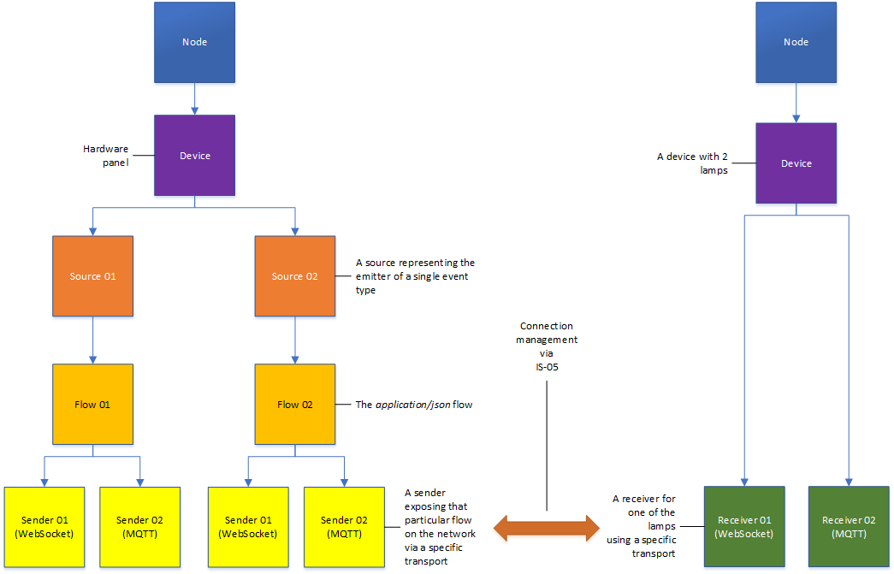

# Core models

_(c) AMWA 2018, CC Attribution-ShareAlike 4.0 International (CC BY-SA 4.0)_

This document specifies the core models and strategies employed.

Other sections can be accessed from the [Overview](1.0._Overview.md).

## 1. Introduction

The following transports will be supported:

* [MQTT](5.1._Transport_-_MQTT.md)
* [Websocket](5.2._Transport_-_Websocket.md)

The specification relies heavily on existing IS-04 resources:

* nodes
* devices
* sources
* flows
* senders
* receivers

In the following sections we will discuss all of them in particular and mention any changes or additions they might need in order to make the event and tally work possible.

In terms of relationships and workflows the following diagram shows an example:



The diagram does not aim to show any ownership but instead relationships and workflows. A source is the emitter of a particular type of event and plays a vital role in identity. A flow describes the media type for the associated event_type. A sender reflects the transport used to package a particular flow on to the network and a receiver is capable of receiving a set of event types using a particular transport.

## 2. Nodes

There is no change or addition required from the IS-04 v1.2 schema.

## 3. Devices

There is no change or addition required from the IS-04 v1.2 schema but additional controls will be added to the `controls` array for Websocket transport and for the Event & Tally REST API (see [Websocket transport](5.2._Transport_-_Websocket.md) and [Event & Tally REST API](6.0._Event_and_tally_rest_api.md)).

## 4. Sources

Event sources require a new string field called `event_type` in order to describe the event type emitted.
Event sources will use the `urn:x-nmos:format:data` format.

Example:

```json
{
    "tags": {},
    "caps": {},
    "parents": [],
    "description": "Vision Mixer In 5 Active",
    "format": "urn:x-nmos:format:data",
    "label": "Vision Mixer In 5 Active",
    "id": "7a855001-0a87-4ce1-b490-b9d648cd6566",
    "device_id": "9ce6993a-db5f-47c9-babe-ee956945006d",
    "version": "1530806114:000000000",
    "clock_name": null,
    "channels": null,
    "event_type": "boolean"
}
```

## 5. Flows

Event flows will use the `urn:x-nmos:format:data` format and will have the media_type set to `application/json`.

Example:

```json
{
    "tags": {},
    "parents": [],
    "description": "Virtual Button 1",
    "format": "urn:x-nmos:format:data",
    "label": "Virtual Button 1",
    "id": "ff455cf3-fb17-448b-8f4c-e6c0e294f5ed",
    "source_id": "7b9d4864-5d6d-4227-a81d-8dd3e13e99b3",
    "version": "1529676926:000000000",
    "media_type": "application/json",
    "device_id": "58f6b536-ca4c-43fd-880a-9df2501fc125"
}
```

## 6. Senders

The supported transports will be extended to include:

* urn:x-nmos:transport:mqtt
* urn:x-nmos:transport:websocket

Example:

```json
{
    "tags": {},
    "interface_bindings": [
        "eth0"
    ],
    "subscription": {
        "receiver_id": null,
        "active": false
    },
    "description": "Virtual Button 1",
    "transport": "urn:x-nmos:transport:mqtt",
    "label": "Virtual Button 1",
    "id": "68f519a3-5523-4b2c-b72d-ec23cc80207d",
    "device_id": "58f6b536-ca4c-43fd-880a-9df2501fc125",
    "flow_id": "0554b43a-ea7c-418d-a39e-1205ee281af3",
    "manifest_href": "",
    "version": "1529676926:000000000"
}
```

## 7. Receivers

Event receivers require a new array called `event_types` inside the `caps` field in order to list all of the event types they can consume (more details in [Event types](3.0._Event_types.md)).  
Event receivers will use the `urn:x-nmos:format:data` format.

The supported transports will be extended to include:

* urn:x-nmos:transport:mqtt
* urn:x-nmos:transport:websocket

Example:

```json
{
    "tags": {},
    "caps": {
        "event_types": [
            "boolean"
        ]
    },
    "interface_bindings": [
        "eth0"
    ],
    "description": "Virtual Lamp 1",
    "format": "urn:x-nmos:format:data",
    "transport": "urn:x-nmos:transport:mqtt",
    "label": "Virtual Lamp 1",
    "id": "8a7bb1c1-4a82-4fd9-a4fb-96f68f560831",
    "device_id": "58f6b536-ca4c-43fd-880a-9df2501fc125",
    "version": "1529676926:000000000",
    "subscription": {
        "sender_id": null,
        "active": false
    }
}
```

## 6. Connection management

For connection management of resource defined in this specification only IS-05 connection management should be used, i.e. not the legacy IS-04 connection management.

This specification defines three new transport parameters to be used in a `PATCH` request:

* `broker_topic`
* `websocket_url`
* `rest_api_url`

The usage will be detailed in each [transport](5.0._Transports.md) section and in the [Event & Tally REST API](6.0._Event_and_tally_rest_api.md) section.
